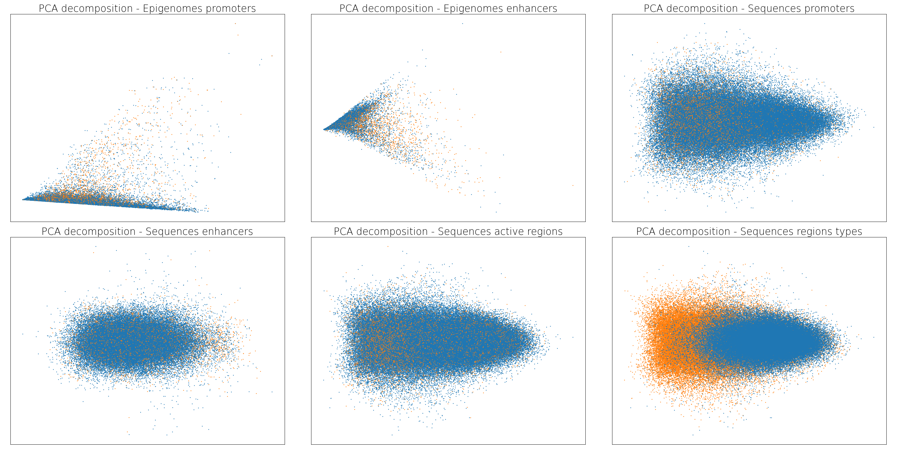
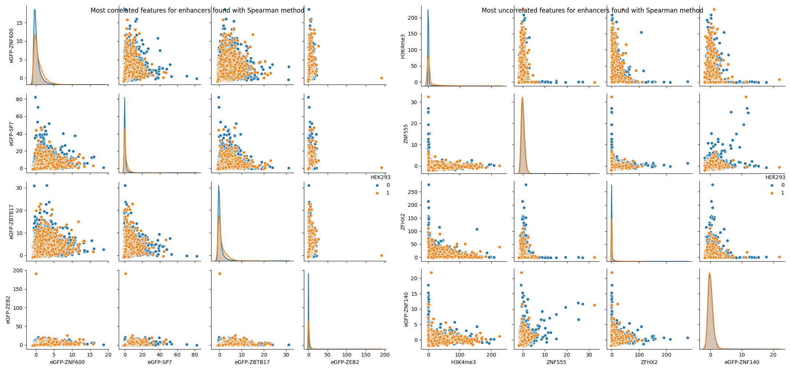
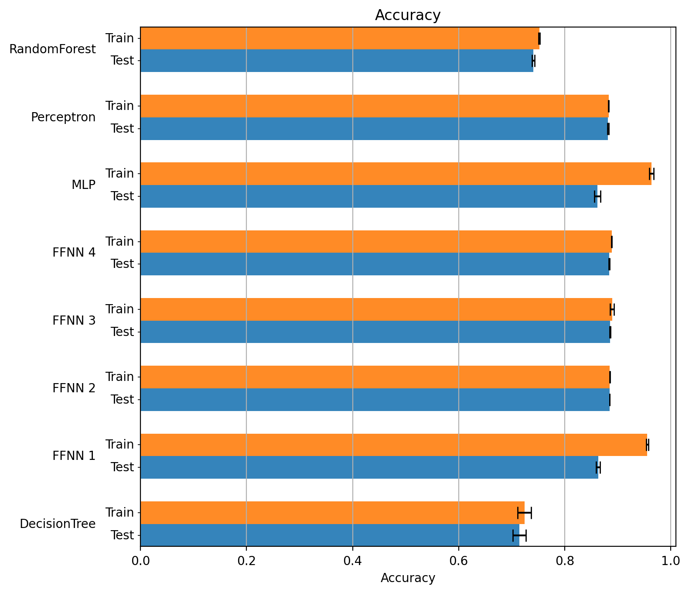
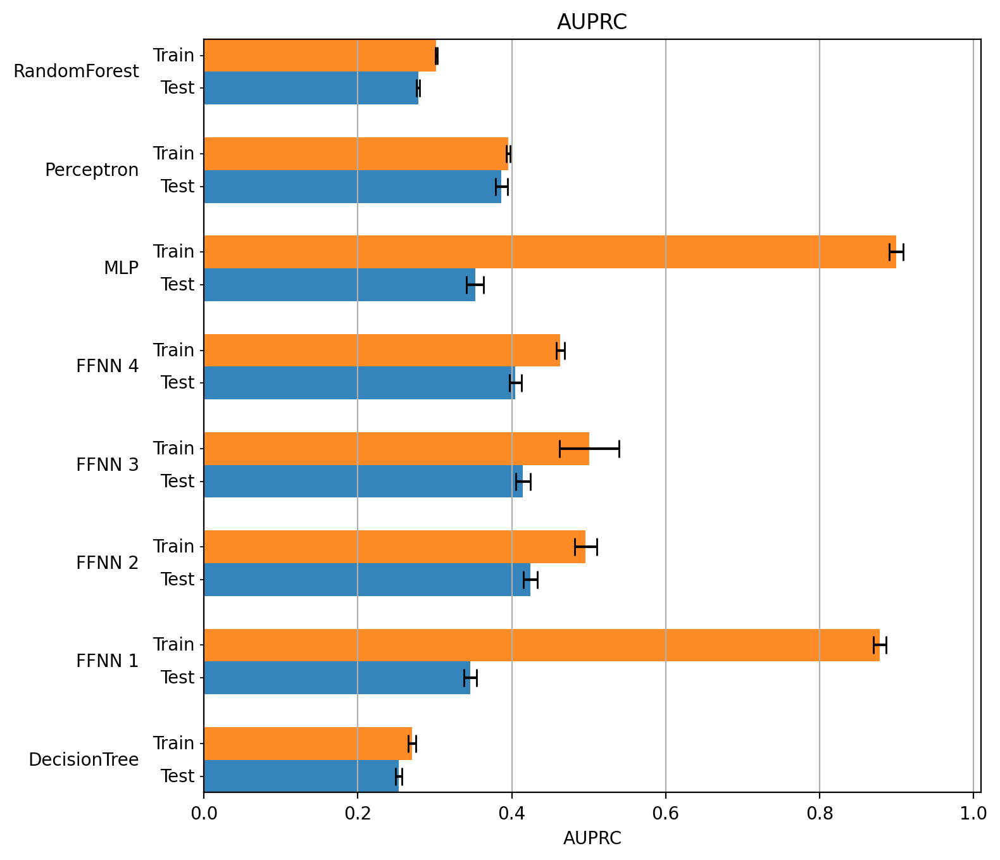

Bioinformatics project

Analyze the active regulatory region of DNA using FFNN and CNN.

           

## Test coverage

Since some software handling coverages sometimes get slightly different results, here's three of them:

      

# Introduction

The phenotype is a term used in genetics to define the set of observable traits in an organism. It can be seen as the result of three factors: the expression of the genetic code of an organism, its interaction with the environment, and some casual events which can occur during its life. In particular, the main aspect is the gene expression, which is the process by which the information from a gene is used to synthesize all functional gene products, like RNA or proteins, essential for the life of all organisms and many viruses. The first step to define the gene expression is to study the DNA, which is the essential molecule that characterizes the organisms in general. It contains all the genetic instructions which regulate this process. Starting from its structure, the DNA is composed of two chains of nucleotides, combined to compose a double helix. This molecule can be divided into subsequences of nucleotides and each of them has a specific task. These sequences can be grouped into two sets according to their main purpose: the coding and non-coding regions. The coding regions (the gene) contain the information to synthesize some gene products and the non-coding regions are responsible to help, regulate or modify the creation process of a specific gene product. The gene expression involves both these regions of the DNA and it is composed of two main processes: transcription and translation. Through the transcription process, a particular DNA coding region is copied inside the messenger RNA (mRNA) thanks to some proteins, the RNA polymerase and other transcription factors, specific for each gene product. In particular, RNA polymerase binds to a particular region of DNA, called the promoter, and activates the transcription process. The initial version of mRNA contains redundant information and it consists of alternating segments called exons (coding regions) and introns (redundant regions). The RNA splicing method is applied to remove the introns and to produce the final mRNA sequence. After that, the mRNA goes out from the cell nucleus, and then the translation process starts. The mRNA sequence is divided into small groups of 3 nucleotides. Each of these triplets, also known as codon, corresponds to a specific amino acid. The result sequence of amino acids forms the final gene product. It is important to specify that a single coding region can generate many different products and the non-coding region play a big role in gene expression. There are two main types of non-coding regions: trans-regulatory elements (TREs) and cis-regulatory elements (CREs). TREs are particular types of genes that may modify or regulate the expression of other genes, often encoding transcription factors. Other non-coding regions, the CREs, are close to the genes that they regulate by bindings to the transcription factor. In particular, enhancers and silencers interact with promoters, through RNA polymerase and other transcription factors, to influence or repress, respectively, the gene expression. There are hundreds of different cell types in an organism despite they share the same DNA. This means that the gene expression is different according to the cell line and the type of product to be synthesized. In particular, the DNA may be used by the cell in very different ways and its regions may be active or inactive, producing a different level of expression for each gene. Determine the activation of the regions is a very important task in biology, it can be useful to determine the phenotype expressed by an organism or to control the gene expression in a specific cell line or, again, to understand better the complex interaction between the DNA and the transcription factors. Besides, this technique can help during the diagnosis, to determine the current or future pathology or to find the best therapy according to the genetic characteristics of the patient. However, determine if a DNA region is active or not is very hard and expensive: the amount of data to collect is huge and its analysis is very complex. The new information technologies can help to simplify this task, supervised machine learning in particular. The idea is to train a learning machine using some examples, DNA regions labeled as active and inactive, so that it can predict the status of an unknown region considering only its specific features. In the literature, a lot of methods are proposed. In [1] it is used a deep feedforward neural network to predict active enhancer, active promoter, active exon, inactive enhancer, inactive promoter, inactive exon, and uncharacterized regions. Another method, DeepEnhancer [2], uses CNN to find enhancers and specialize in the learning process on the cell line using the transfer learning technique. Moreover, Basset [3] is an open-source system that applies CNN to learn simultaneously the relevant DNA sequence motifs and the regulatory logic to determine cell-specific DNA accessibility. Following work, Basenji [4], modify the previous system to identify promoters and the relative regulatory elements and synthesize their content to make more precise gene expression predictions.

# Models

This project aims to predict if regulatory elements, such as promoters and enhancers, are active or inactive in a specific cell line using supervised deep learning methods. More precisely, the tasks are two: predict the activity or inactivity of the promoters and predict the activity or inactivity of enhancers in a specific cell line, the HEK293. As mentioned in the introduction, the DNA is the same in all the cells of an organism but the gene expression changes according to the cell type and its function. This process, which is really complex and largely still unknown, is heavily influenced by the activity of the CREs. However, locate the active DNA region is a very complex and expensive task in Biology and Computer Science can help to predict active regulatory elements using features that characterize them. The type of data related to the regulatory region (promoters and enhancers) are two: the epigenomic and sequence data. The two tasks described before (to distinguish active and inactive enhancers and promoters) are performed using both epigenomic and sequence data. To do this, supervised machine learning methods are used. In particular, given the diversity of the two types of data, two different models are used in his project: FFNN (feedforward neural network) and CNN (convolutional neural network), respectively for epigenomic and sequence data. These models are very complicated, not easy to set up, and computationally hard to execute. To verify the performance of these models, their results are compared with those of simpler learning machines: decision tree, random forest, perceptron, and multilayer perceptron (MLP).

## FFNN 

The feed-forward neural networks are used to analyze the epigenomic data related to promoters and enhancers. Each region is characterized by a lot of features, about 200, so the data have high dimensionality. An FFNN is suitable for processing these data using more layers and neurons. In particular, in this project, three different types of FFNN are tested. The first model (called FFNN_1) has a classical architecture and it is set using almost standard parameters. Its purpose is to examine the network performance with the given dataset to build a better model.

| Layers  | Type                | Units | Activation | Probability |
| ------- | ------------------- | ----- | ---------- | ----------- |
| Layer 1 | Dense               | 256   | ReLU       | -           |
| Layer 2 | Dense               | 128   | ReLU       | -           |
| Layer 3 | Batch Normalization | -     | ReLU       | -           |
| Layer 4 | Dense               | 64    | ReLU       | -           |
| Layer 5 | Dropout             | -     | -          | 0.3         |
| Layer 6 | Dense               | 32    | ReLU       | -           |
| Layer 7 | Dense               | 16    | ReLU       | -           |
| Layer 8 | Dense               | 1     | Sigmoid    | -           |

| Parameter        | Value                             |
| ---------------- | --------------------------------- |
| Weight estimator | nadam                             |
| Learning rate    | 0.001                             |
| Loss function    | binary crossentropy               |
| Epochs           | 1000                              |
| Batch size       | 1024                              |
| Validation split | 0.1                               |
| Shuffle          | true                              |
| Early stopping   | monitor = val_loss, patience = 50 |

The second feedforward neural network (FFNN_2) is similar to the first: it has only more Dropout layers with a higher rate to prevent overfitting.

| Layers   | Type                | Units | Activation | Probability |
| -------- | ------------------- | ----- | ---------- | ----------- |
| Layer 1  | Dense               | 256   | ReLU       | -           |
| Layer 2  | Dropout             | -     | -          | 0.5         |
| Layer 3  | Batch Normalization | -     | ReLU       | -           |
| Layer 4  | Dense               | 128   | ReLU       | -           |
| Layer 5  | Dropout             | -     | -          | 0.5         |
| Layer 6  | Dense               | 64    | ReLU       | -           |
| Layer 7  | Dropout             | -     | -          | 0.5         |
| Layer 8  | Dense               | 32    | ReLU       | -           |
| Layer 9  | Dropout             | -     | -          | 0.5         |
| Layer 10 | Dense               | 16    | ReLU       | -           |
| Layer 11 | Dropout             | -     | -          | 0.5         |
| Layer 12 | Dense               | 1     | Sigmoid    | -           |

| Parameter        | Value                             |
| ---------------- | --------------------------------- |
| Weight estimator | nadam                             |
| Learning rate    | 0.001                             |
| Loss function    | binary crossentropy               |
| Epochs           | 1000                              |
| Batch size       | 1024                              |
| Validation split | 0.1                               |
| Shuffle          | true                              |
| Early stopping   | monitor = val_loss, patience = 50 |

The third learning machine (FFNN_3) tries to resolve the problem of data imbalance. First of all, a bias is added to the last layer to reflect the class imbalance. Then, a particular parameter that specifies the class weight is passed for the learning procedure. This solution is taken from this official Tensorflow [guide](https://www.tensorflow.org/tutorials/structured_data/imbalanced_data). In this network is also set a different early stopping condition, which maximizes the AUPRC and restores the best weights after each epoch. 

| Layers  | Type                | Units | Activation | Probability | Notes            |
| ------- | ------------------- | ----- | ---------- | ----------- | ---------------- |
| Layer 1 | Dense               | 256   | ReLU       | -           | -                |
| Layer 2 | Batch Normalization | -     | ReLU       | -           | -                |
| Layer 3 | Dense               | 128   | ReLU       | -           | -                |
| Layer 4 | Dense               | 64    | ReLU       | -           | -                |
| Layer 5 | Dense               | 32    | ReLU       | -           | -                |
| Layer 6 | Dropout             | -     | -          | 0.5         | -                |
| Layer 7 | Dense               | 16    | ReLU       | -           | -                |
| Layer 8 | Dropout             | -     | -          | 0.5         | -                |
| Layer 9 | Dense               | 1     | Sigmoid    | -           | bias initializer |

| Parameter        | Value                                                        |
| ---------------- | ------------------------------------------------------------ |
| Weight estimator | nadam                                                        |
| Learning rate    | 0.001                                                        |
| Loss function    | binary crossentropy                                          |
| Epochs           | 1000                                                         |
| Batch size       | 1024                                                         |
| Validation split | 0.1                                                          |
| Shuffle          | true                                                         |
| Early stopping   | monitor = val_aurpc, patience = 50, restore_best_weight = true |
| Class weight     | dictionary with class weight                                 |

The last model type (FFNN_4) is inspired by Bayesian-FFNN explained in [5], constructed using the Bayesian optimization method. Its architecture is composed of 3 hidden layers with an l2 regularizer, which apply a penalty on the layer's kernel. 

| Layers  | Type  | Units | Activation | Regularizer l2 |
| ------- | ----- | ----- | ---------- | -------------- |
| Layer 1 | Dense | 256   | ReLU       | 0.001          |
| Layer 3 | Dense | 128   | ReLU       | 0.001          |
| Layer 4 | Dense | 64    | ReLU       | 0.001          |
| Layer 8 | Dense | 1     | Sigmoid    | -              |

| Parameter           | Value                             |
| ------------------- | --------------------------------- |
| Weight estimator    | SGD                               |
| Learning rate       | 0.1                               |
| learning rate decay | 0.01                              |
| Loss function       | binary crossentropy               |
| Epochs              | 1000                              |
| Batch size          | 100                               |
| Validation split    | 0.1                               |
| Shuffle             | true                              |
| Early stopping      | monitor = val_loss, patience = 50 |

## CNN

The convolutional neural networks are used to analyze the sequence data because they can find patterns or motives which characterize this type of data. In the sequence data the features are hidden inside the sequence itself, so a CNN at first learns what are the data features using convolutional layers and subsequently uses these features to label the data thanks to fully connected layers. A feed-forward neural network uses only nucleotide locations as functionality but this information is too weak to effectively classify data. In this project are build and tested three different CNNs. The first network (CNN_1) is used to evaluate the performance of the network using the data related to the HEK293 cell line.

| No. of Layers | Type    | Units | Kernel size | Activation | Notes             |
| ------------- | ------- | ----- | ----------- | ---------- | ----------------- |
| 1             | Reshape | -     | -           | -          | shape = 200, 4, 1 |
| 2             | Conv2D  | 64    | 10, 2       | ReLU       | -                 |
| 1             | Dropout | -     | -           | -          | Probability = 0.3 |
| 1             | Conv2D  | 32    | 10, 2       | ReLU       | strides = 2, 1    |
| 2             | Conv2D  | 32    | 10, 1       | ReLU       | -                 |
| 1             | Dropout | -     | -           | -          | Probability = 0.3 |
| 1             | Flatten | -     | -           | -          | -                 |
| 1             | Dense   | 32    | -           | ReLU       | -                 |
| 1             | Dense   | 16    | -           | ReLU       | -                 |
| 1             | Dense   | 1     | -           | Sigmoid    | -                 |

| Parameter        | Value               |
| ---------------- | ------------------- |
| Weight estimator | nadam               |
| Learning rate    | 0.001               |
| Loss function    | binary crossentropy |
| Epochs           | 100                 |
| Batch size       | 1024                |
| Shuffle          | true                |

The second network (CNN_2) has a different architecture. In particular, the convolutional layers have a larger unit number, to better find the patterns and features which characterized the data, and they apply a stride to reduce the parameter number. Besides, the dropout related to the fully-connected layer is increased to reduce overfitting.

| No. of Layers | Type                | Units | Kernel size | Activation | Notes             |
| ------------- | ------------------- | ----- | ----------- | ---------- | ----------------- |
| 1             | Reshape             | -     | -           | -          | shape = 200, 4, 1 |
| 1             | Conv2D              | 128   | 16, 4       | ReLU       | -                 |
| 1             | Batch Normalization | -     | -           | ReLU       | -                 |
| 1             | Max Pooling 1D      | -     | 5           | ReLU       | strides = 2, 1    |
| 1             | Conv1D              | 64    | 12          | ReLU       | -                 |
| 1             | Batch Normalization | -     | -           | ReLU       | -                 |
| 1             | Max Pooling 1D      | -     | 4           | ReLU       | strides = 2, 1    |
| 1             | Conv1D              | 32    | 5           | ReLU       | -                 |
| 1             | Batch Normalization | -     | -           | ReLU       | -                 |
| 1             | Max Pooling 1D      | -     | 2           | ReLU       | strides = 2, 1    |
| 1             | Flatten             | -     | -           | -          | -                 |
| 1             | Dense               | 64    | -           | ReLU       | -                 |
| 1             | Dropout             | -     | -           | -          | Probability = 0.4 |
| 1             | Dense               | 32    | -           | ReLU       | -                 |
| 1             | Dropout             | -     | -           | -          | Probability = 0.4 |
| 1             | Dense               | 16    | -           | ReLU       | -                 |
| 1             | Dropout             | -     | -           | -          | Probability = 0.3 |
| 1             | Dense               | 1     | -           | Sigmoid    | -                 |

| Parameter        | Value               |
| ---------------- | ------------------- |
| Weight estimator | nadam               |
| Learning rate    | 0.001               |
| Loss function    | binary crossentropy |
| Epochs           | 100                 |
| Batch size       | 1024                |
| Shuffle          | true                |

The last model is inspired by Bayesian-CNN explained in [5]. Its architecture and parameters, written in the tables below, are optimized using the Bayesian method. Different from the previous CNNs, this network uses the data a single dimension. The tables below show their characteristics.

| No. of Layers | Type                         | Units | Kernel size | Activation | Notes             |
| ------------- | ---------------------------- | ----- | ----------- | ---------- | ----------------- |
| 1             | Reshape                      | -     | -           | -          | shape = 800, 1    |
| 3             | Conv1D + Batch Normalization | 64    | 5           | ReLU       | -                 |
| 1             | Max Pooling 1D               | -     | 2           | -          | -                 |
| 1             | Conv1D + Batch Normalization | 64    | 10          | ReLU       | -                 |
| 1             | Max Pooling 1D               | -     | 2           | -          | -                 |
| 1             | Flatten                      | -     | -           | -          | -                 |
| 1             | Dense                        | 64    | -           | ReLU       | -                 |
| 1             | Dropout                      | -     | -           | -          | Probability = 0.1 |
| 1             | Dense                        | 64    | -           | ReLU       | -                 |
| 1             | Dropout                      | -     | -           | -          | Probability = 0.1 |
| 1             | Dense                        | 1     | -           | Sigmoid    | -                 |

| Parameter        | Value               |
| ---------------- | ------------------- |
| Weight estimator | nadam               |
| Learning rate    | 0.002               |
| Loss function    | binary crossentropy |
| Epochs           | 100                 |
| Batch size       | 1024                |
| Shuffle          | true                |

## Comparison models

To validate the results of feed-forward and convolutional neural networks is necessary to compare them with simpler models. It is necessary to justify the complexity introduced by FFNNs and CNNs and show that they perform better than other learning machines. If this is not verified or the performances are similar, the use of simpler models is recommended. The comparison models are decision tree, random forest, perceptron, and multi-layer perceptron.

### Decision tree

The hyper-parameters of the decision tree are chosen using the Grid Search technique. This method consists of choosing the type of parameters, define a set of values for each parameter, and iteratively explore all the possible combinations to find the best parameter configuration. This method is applied two times, both for promoters and enhancers, to increase the granularity and reduce the range of the parameter space. This learning machine is used only in the epigenomic experiments because it is unable to understand the complex structure of sequence data. In the table below are shown the parameters space and the best value found by the Grid Search method for the first iteration.

| Parameters   | Explored values                   | Best value for promoters | Best value for enhancers |
| ------------ | --------------------------------- | ------------------------ | ------------------------ |
| Max depth    | 2, 10, 20, 30 , 40 , 50, 100, 200 | 10                       | 10                       |
| class weight | non-balanced, balanced            | balanced                 | balanced                 |

Now the method is applied again with a more refined setting. The table below contains the values explored and the best choice for the two regions.

| Parameters   | Explored values                    | Best values for promoters | Best value for enhancers |
| ------------ | ---------------------------------- | ------------------------- | ------------------------ |
| Max depth    | 2, 3, 4, 5, 6, 7, 8, 9, 10, 12, 14 | 7                         | 6                        |
| class weight | non-balanced, balanced             | balanced                  | balanced                 |

### Random forest

As in the case of the decision tree, the random forest hyper-parameters are chosen using the Grid Search technique applied two times and this model is used only in the epigenomic experiments. The table below shows the parameters space and the best value for promoters and enhancers at the first iteration.

| Parameters       | Explored values                   | Best value for promoters | Best value for enhancers |
| ---------------- | --------------------------------- | ------------------------ | ------------------------ |
| N. of estimators | 10, 20, 30, 40, 50, 100, 200, 500 | 100                      | 100                      |
| Max depth        | 2, 10, 20, 30 , 40 , 50, 100      | 10                       | 10                       |
| class weight     | non-balanced, balanced            | balanced                 | balanced                 |

The table below shows the final parameters chosen in refined intervals.

| Parameters       | Explored values                    | Best value for promoters | Best value for enhancers |
| ---------------- | ---------------------------------- | ------------------------ | ------------------------ |
| N. of estimators | 60, 70, 80, 90, 100, 120, 140, 160 | 90                       | 140                      |
| Max depth        | 6, 8, 10, 12, 14, 16, 18, 20       | 8                        | 6                        |
| class weight     | non-balanced, balanced             | balanced                 | balanced                 |

### Percepetron and multi-layer perceptron

The perceptron and multi-layer perceptron are included in the comparison models because they are the simpler version of feed-forward and convolutional neural network, so they are used both in epigenomic and sequence experiments. The model of the perceptron is the simpler neural network, formed by an input layer and a single output neuron without any hidden layer. Its structure and the parameters are shown in the tables below.  

| Layers  | Type  | Units | Activation |
| ------- | ----- | ----- | ---------- |
| Layer 1 | Dense | 1     | ReLU       |

| Parameter        | Value                             |
| ---------------- | --------------------------------- |
| Weight estimator | nadam                             |
| Learning rate    | 0.001                             |
| Loss function    | binary crossentropy               |
| Epochs           | 1000                              |
| Batch size       | 1024                              |
| Validation split | 0.1                               |
| Shuffle          | true                              |
| Early stopping   | monitor = val_loss, patience = 50 |

The multi-layer perceptron has some hidden layers between the input and output layers. The tables below contain their structure and learning parameters.

| Layers   | Type  | Units | Activation | Probability |
| -------- | ----- | ----- | ---------- | ----------- |
| Layer 1  | Dense | 256   | ReLU       | -           |
| Layer 4  | Dense | 128   | ReLU       | -           |
| Layer 6  | Dense | 32    | ReLU       | -           |
| Layer 10 | Dense | 1     | Sigmoid    | -           |

| Parameter        | Value                             |
| ---------------- | --------------------------------- |
| Weight estimator | nadam                             |
| Learning rate    | 0.001                             |
| Loss function    | binary crossentropy               |
| Epochs           | 1000                              |
| Batch size       | 1024                              |
| Validation split | 0.1                               |
| Shuffle          | true                              |
| Early stopping   | monitor = val_loss, patience = 50 |

# Experimental setup

## Data retrieval

In this project, it is analyzed a specific cell line, HEK293, in order to predict the activation of promoters and enhancers. We consider a set of regions of the human genome, 200 nucleotide long. Each region corresponds to a CRE (promoter or enhancer), which may be active or not, and it is characterized by both sequence and epigenomic data. In detail, the sequence data is simply the nucleotide sequence and the epigenomic data refers to the level of interaction between the region and proteins. Starting from the epigenomic data, they come from the [ENCODE](https://www.encodeproject.org/) project and the data considered are obtained by the ChiP-sequencing technique. The labels of our data, that say if a region is active or inactive, are taken from FANTOM, which contains a wide collection of promoters and enhancers and indicates if they are active or not in a specific cell line. The amount of data obtainable from ENCODE is extremely large and they must be queried with the FANTOM data to extract only the region considered in this project. Fortunately, this task has been already done and the epigenomic data of promoters and enhancers can be found in this [repository](https://github.com/LucaCappelletti94/epigenomic_dataset), which offers also a python package to automatically download and use these data. The sequence data instead requires the genome sequence of the cell line, obtainable from [UCSC Genome Browser](https://genome.ucsc.edu/index.html) with this python [utility](https://github.com/LucaCappelletti94/ucsc_genomes_downloader), which can be filtering in order to obtain only the nucleotide sequences of promoters and enhancers.

## Data preprocessing

### Epigenomic data

The dataset obtained has to be processed to remove wrong values and make data easier to analyze. It is important to specify that only the epigenomic features are preprocessed. In particular, the data are modified through the following operations:

* **NaN values substitution:** in biology experiments, there are some practical cases where some data could be NaN. This situation, especially when the NaN values are many, is dangerous for the learning model. If it happens, there are a lot of different techniques to fix it. If there NaN values are concentrated in a single sample or in a single feature it is convenient to remove it. Otherwise, if the NaN values are scattered in all dataset, they could be replaced by empirical values, like the mean or the median. In the dataset used in this project, there are only one NaN value in the enhancers epigenomic data and no one for the promoters. This single NaN value has been replaced with the median.
* **Constant feature elimination:** in some dataset could be features with the same value for each sample. This situation doesn't help the learning machine and the these features can be removed. This is not the case of the data used in this project. every features has different values in at most one sample.
* **Z-scoring:** it is a way to standardizing the data. The Z-score is the number of standard deviation by which the value of a raw score is closed to the population mean: it is positive if it is above the mean or it is negative otherwise. The Z-scoring is calculated by subtracting the average and dividing by the standard deviation. In this way, the new data have mean 0 and variance 1. This method has a problem related to the outliers and it has to be fixed by subtracting the median and dividing by the standard deviation between the interquartile range from 0.25 to 0.75. This method, applied to the project data, is also called Robust Scaler.

### Sequence data

The sequence data are composed of a series of 200 letters of 4 different types, one for each nucleotide. To be used by the models, these data must be converted in numbers. To do this, it is applied to the one-not encoding technique, which converts each letter in the sequence into four numbers which represent the four letters. These numbers are normally 0 except the number that corresponds to the letter which is set to 1. After this process, the initial sequences formed by 200 letters are encoded in a series of 800 numbers. 

## Data checking

In an machine learning project, it is very important to check if the data can effectively used by machine learning models. First of all it is necessary to verify the sample-feature imbalance. This control aim to verify the rate between samples and features. Having a low rate means that the sample are few respect to the features and the learning machine isn't able to generalize on the real data. Fortunately, this isn't the case of this dataset, in particular the rate between sample and features for promoters is 482 and 316 for enhancers. Another important factor ti consider is the imbalance between the classes. In some real dataset, especially in biology, there could be a strong imbalance between classes. For example, if it is considered a rare disease, the positive samples are few than the negative one and the learning machine will tend to predict a wrong result, tending to the majority class. In these cases, it is necessary to adopt techniques to avoid this problem. This is not the case of this dataset because the rate between negative and positive example is 7.68 for promoters and 8.41 for enhancers as shown in the figure.

## Data visualization

### Data distribution

Visualizing the data distribution is helpful to better understand the dataset composition. Since the features are about 200 and it is difficult and useless to represent all distributions, there were selected and represented the 5 most different features between active and inactive regions, both for promoters and enhancers. The histograms below represent the Euclidean distance between the feature values, which are filtered before 0.05 and after 0.95 percentile to reduce the impact of the outliers. In particular, the blue and orange colors refers to inactive and active region respectively. The first image shows the feature distributions of promoters and the second one shows the enhancers features distributions.

Another interesting point of view is given by the visualization of the differences between the distributions of the pairs of features. As done in the previous method, only the 5 most different pairs of features are considered and the values are filtered between 0.05 and 0.95. This time the colors represent the two features and not the regions activation. 

### Data decomposition

The data decomposition is the process through which the data dimensionality is reduced in order to visualize the data distribution in a 2D or 3D space. In this way the curse of dimensionality is partially reduced. The coursed phenomena appears in a machine learning problem when the data dimensionality increases, beacuse the volume of the space grows and the data become sparse, invalidating any method that requires statistical significance. In the specific domain of machine learning, for each dimension there should be at least 5 samples for not overfitting the model. In this case the data decomposition technique is used only for visualization purpose. 

#### PCA

The principal component analysis (PCA) uses a simple idea: given a collection of points in multi dimensional space, a best fitting line is the one that minimizes the average square distance from the points to the line. The next best-fitting line is similar but chosen from the direction orthogonal to the first. Repeating this process produces an orthogonal basis in which different individual dimensions of the data are uncorrelated. These basis vectors are called principal components. This transformation is defines as follow: the first principal component has the largest possible variance and the succeeding components has the highest variance under the constraint that it is orthogonal to the previous component. It is important to specify that PCA is sensitive to the relative scaling of the original variables: this is why it has be run before applying the z-scoring. The figure below shows the PCA decomposition for:

* epigenomic data of active and inactive promoters;
* epigenomic data of active and inactive enhancers;
* sequence data of active and inactive promoters;
* sequence data of active and inactive enhancers;
* sequence data of active and inactive regions (both promoters and enhancers);
* sequence data of region types.

#### TSNE

 The T-distributed Stochastic Neighbor Embedding (TSNE) is an algorithm for data visualization. It applies a nonlinear dimensionality reduction and it is particularly effective for visualizing high-dimensionality data in a low dimensional space of two or three dimensions. Specifically, similar objects in high dimension are modeled by nearby points in two or three dimensions and dissimilar objects are modeled by distant points with high probability. In this project are used [tsne-cuda](https://github.com/CannyLab/tsne-cuda), the state of the art TSNE implementation which runs in GPU, developed by CannyLab of the Berkeley university. The figure below shows the data decomposition obtained with TSNE (set with 42 of random seed and 5000 of perplexity, to prevent errors) for:

* epigenomic data of active and inactive promoters;
* epigenomic data of active and inactive enhancers;
* sequence data of active and inactive promoters;
* sequence data of active and inactive enhancers;
* sequence data of active and inactive regions (both promoters and enhancers);
* sequence data of region types.

## Feature selection

Since the epigenomic data has a large number of feature, it is important to apply methods to find those features which are unnecessary or dangerous for the learning machines and to remove them. Only he epigenomic data are treated using this procedure, while the sequence data are used as is. In this project, three different types of feature selection techniques are used: 

- **Check of feature-output correlation:** the feature not correlated with output can be removed. In particular, the Person and Spearman methods are used to finding monotonic and linear correlation respectively and, subsequently, the uncorrelated features found using these methods are tested with the MIC algorithm to check non-linear correlation with output. In the end, those features whit no correlation with output (bot linear and non-linear) are removed. 
- **Check of feature-feature correlation:** the pairs of feature strongly correlated are not necessary for the learning machine, because they express the "same concept". In this way, in a pair of correlated features, the one with less entropy can be removed. In this project are applied the Pearson and Spearman method to check feature-feature monotonic correlation.
- **Automatic feature selection:** the last way to remove feature is to test their utility for a learning machine. In particular, The Boruta method with a random forest is applied to the data and those features useless for that model have been dropped.

All these techniques are applied. The initial amount of features is 207 for promoters and enhancers. More in detail, the following pipeline is applied for feature selection:

- Apply the Pearson method for feature-output correlation. There are selected 9 uncorrelated features for promoters and 28 for enhancers with a p_value threshold of 0.01

- Apply the Spearman method for feature-output correlation. There are selected 6 uncorrelated features for promoters and 27 for enhancers with a p_value threshold of 0.01

- The uncorrelated features found with Pearson and Spearman are not unique, so the two sets are unified with no repetition. The resulting set has 12 and 32 features for promoters and enhancers respectively

- Apply the MIC method for feature-output correlation on the feature selected with Pearson and Spearman to check the non-linear correlation. After the execution, MIC find no non-linear correlation on the examined features with a threshold of 0.05, so there are removed 12 features for promoters and 32 for enhancers

- Apply the Pearson method to find the feature-feature correlation. In this case, there are selected 0 pair of extremely correlated features using a p_value threshold of 0.01 and a correlation threshold of 0.95, so no features are removed

- Apply the Spearman method to find the feature-feature correlation. In this case, there are selected 0 pair of extremely correlated features using a p_value threshold of 0.01 and a correlation threshold of 0.95, so no features are removed

- Apply the Boruta method to remove the features useless for the random forest. The random forest classifier is set using the following parameters:

- - n_estimators = auto
  - alpha = 0.05
  - max_iter = 10
  - random_state = 42

- After 300 iterations Boruta finds 4 useless features for promoters and 36 for enhancers.

- In the end, the total amount of features is 191 and 139 for promoters and enhancers respectively. In the following subsections, the features selection techniques are explained more in detail. 

### Data correlation with output

A check which can be applied to the data is the correlation between features and output. If a feature isn't correlated with a specific output it is completely useless and it can be dropped. To do this, the Pearson and Spearman tests are applied, which measure the monotonic and linear correlations respectively. After that, the candidate non-correlated features are tested with the MIC (Maximal information coefficient) that tests the non-linear correlation between features and output. Only the features found with Pearson and Spearman methods are tested using MIC to check if they nave non-linear correlation with output. More in detail, the Pearson correlation method measures the linear correlation between the two datasets. In particular, the Pearson coefficient has a value between -1 and +1, where -1 is a total negative linear correlation, 0 implying no correlation, and +1 is a total positive linear correlation. Instead, the Spearman correlation coefficient doesn't require that the two datasets are normalized and it measures the monotonicity relationship between them. The Spearman coefficient varies between -1 and +1, like Pearson's. Now is the moment to apply the MIC procedures to the feature selected by Pearson and Spearman method in order to find non-linear correlations. It is important to specify that Pearson's, Spearman's and MIC's results are significant if they are is calculated over a large dataset, typically with 500 samples or more. In the end, the features uncorrelated with output can be removed.

### Feature correlation

To make the data less heavy, it is possible to find and remove tightly correlated features. The correlation can be measured using the Pearson or MIC method. In this project, the Pearson method is used to save time (MIC is computationally complex). When two features appear correlated, the one with the lower entropy is removed. The entropy can be interpreted as the average level of information or uncertainty given by a variable. In this project, there aren't features extremely correlated but it is interesting to examine the most correlated and least correlated features, as shown in the images below. The first pair of images show the most correlated and uncorrelated features in promoters and enhancers respectively found with Pearson Methods. The last pair show the two most correlated and uncorrelated features found with Spearman method. The blue and orange colors refers to inactive and active region respectively.

### Automatic feature selection: the Boruta method

The feature selection is the process of finding the relevant features to use for learning a model. Indeed the data may have some irrelevant or redundant features, which can be removed without information loss to make the learning process easier. Until now the feature selection process was done using manual methods, based on the feature to feature and the feature to output correlation. These methods are certainly effective but there are not enough: the features are considered one or to at a time to find a linear or non-linear correlation between the output or another feature. Boruta, an automatic method for feature selection, considers the features as a whole and use a specific classification algorithm to find the irrelevant features. Boruta is a wrapper built around the random forest algorithm, chosen because it is relatively quick to compute and it usually can run without parameters specification. In fact, Boruta is an ensemble method in which classification is performed by voting of multiple decision trees, each of them is independently developed on different samples of the training set. The importance measure of an attribute is the loss of accuracy of classification, caused by random permutation of this attribute values in the various trees. 

## Experiments evaluation

After preprocessing and feature selection, the data are ready to pass to the learning models. The holdout technique is used for testing the models. This method consists into split the dataset in two separate sets: the training set (used to train the leaning machine to learn) and the test set (used to test the model performances). In this case, the split is 80% and 20% for training and test set. The experiments are executed over multiple holdouts, 50 for epigenomic data, and 3 for sequence data, to make the models' evaluation more robust. In particular, the StratifiedShuffleSplit of sklearn is used to make the holdouts. This method randomly separates the training and test set indices, preserving the percentage of samples for each class. It is set with 42 as random_state parameter. 

The metrics used to evaluate the models are the following:

- **accuracy:** is the ration between the correct predictions and the total number of samples.
- **auPRC**: the area under the precision-recall curve is a useful measure of success of prediction when the classes are imbalanced. The precision-recall curve shows the tradeoff between precision and recall of different thresholds. A high area under the curve represents both high recall and high precision, where high precision relates to a low false-positive rate, and high recall relates to a low false-negative rate. The auPRC value is between 0 and 1 and a high value denotes a good predictor.
- **auROC**: the area under receiver operating characteristic is a metric specific for binary classification tasks. It indicates the fraction between the true positive rate and the false-positive rates. Differently, form auPRC, its values are between 0.5 and 1.

Each metric is calculated for each model the final results are the mean and the standard deviation obtained through the various holdouts. These results are finally compared using the Wilcoxon signed-rank test with a p_value threshold of 0.01. It is a non-parametric statistical test to compare hypotheses made on repeated measures.

# Experimental results

## Epigenomic experiments

### Promoters

#### Results

In this section are reported the experiment results for active vs inactive promoters task using epigenomic data. For each metric there are a table and a plot to confront the learning machine performance.

**Accuracy**

| Models       | Training      | Test          |
|:-------------|:--------------|:--------------|
| DecisionTree | mean = 0.7241 | mean = 0.7148 |
|              | STD = 0.0124  | STD = 0.0123  |
| RandomForest | mean = 0.7522 | mean = 0.7408 |
|              | STD = 0.0014  | STD = 0.0022  |
| Perceptron   | mean = 0.883  | mean = 0.882  |
|              | STD = 0.0005  | STD = 0.0015  |
| MLP          | mean = 0.9638 | mean = 0.8621 |
|              | STD = 0.0041  | STD = 0.0057  |
| FFNN_1       | mean = 0.956  | mean = 0.8634 |
|              | STD = 0.0023  | STD = 0.0037  |
| FFNN_2       | mean = 0.885  | mean = 0.8848 |
|              | STD = 0.0002  | STD = 0.0002  |
| FFNN_3       | mean = 0.8895 | mean = 0.8854 |
|              | STD = 0.0038  | STD = 0.0007  |
| FFNN_4       | mean = 0.8886 | mean = 0.884  |
|              | STD = 0.0007  | STD = 0.0011  |

Examining the accuracy metric, FFNN_3 seems to be the best model. The table below 

**AUROC**

| Models       | Training      | Test          |
|:-------------|:--------------|:--------------|
| DecisionTree | mean = 0.8081 | mean = 0.7862 |
|              | STD = 0.0019  | STD = 0.0033  |
| RandomForest | mean = 0.8384 | mean = 0.8117 |
|              | STD = 0.0008  | STD = 0.0027  |
| Perceptron   | mean = 0.8674 | mean = 0.8638 |
|              | STD = 0.0008  | STD = 0.0026  |
| MLP          | mean = 0.9813 | mean = 0.8433 |
|              | STD = 0.0014  | STD = 0.0054  |
| FFNN_1       | mean = 0.9774 | mean = 0.8392 |
|              | STD = 0.0016  | STD = 0.0057  |
| FFNN_2       | mean = 0.9184 | mean = 0.8766 |
|              | STD = 0.0039  | STD = 0.0028  |
| FFNN_3       | mean = 0.9015 | mean = 0.8733 |
|              | STD = 0.0103  | STD = 0.0042  |
| FFNN_4       | mean = 0.8893 | mean = 0.8727 |
|              | STD = 0.001   | STD = 0.0025  |

**AUPRC**

| Models       | Training      | Test          |
|:-------------|:--------------|:--------------|
| DecisionTree | mean = 0.2703 | mean = 0.2531 |
|              | STD = 0.0046  | STD = 0.0037  |
| RandomForest | mean = 0.3018 | mean = 0.2784 |
|              | STD = 0.0011  | STD = 0.0023  |
| Perceptron   | mean = 0.3953 | mean = 0.3867 |
|              | STD = 0.0022  | STD = 0.0077  |
| MLP          | mean = 0.8998 | mean = 0.3524 |
|              | STD = 0.0089  | STD = 0.011   |
| FFNN_1       | mean = 0.878  | mean = 0.3459 |
|              | STD = 0.0082  | STD = 0.0082  |
| FFNN_2       | mean = 0.496  | mean = 0.4245 |
|              | STD = 0.0145  | STD = 0.009   |
| FFNN_3       | mean = 0.5009 | mean = 0.4146 |
|              | STD = 0.0384  | STD = 0.0092  |
| FFNN_4       | mean = 0.4632 | mean = 0.4047 |
|              | STD = 0.0053  | STD = 0.0076  |

#### Observations

*1) DecisionTree and RandomForest perform worst than other models.* The results show that DecisionTree and Random Forest perform worst than the other models according to all metrics, both for promoters and enhancers.

*2) There is a big problem of overfitting with complex deep networks.* The data decomposition graphs show that the promoters' epigenomic data are not clearly separable and the complex models tend to learn data without generalizing. This happens in particular with the MLP and FFNN_1 and it is visible in the AUPRC metric.

*3) The perceptron performance is comparable with more complex models.* This model indeed does not overfit because of its very simple structure and it can better generalize. In particular, according to the Wilcoxon test, the perceptron performs better than DecisionTree, RandomForest, MLP, and FFNN_1 in all metrics.

*4) The FFNN_3 does not improve the performance despite trying to resolve the class imbalance problem.* The measures adopted have only prevented overfitting but the test result is not the best. Besides, FFNN_3 has the largest STD in the training results according to all metrics.

*5) FFNN_2 is the best model.* According to the Wilcoxon test, this model performs better than the others in all metrics, except for the FFNN_3 according to the accuracy. This model has a complex architecture, composed of 5 hidden layers and a big dropout for each of them. This strategy allows the network to learn the data without overfitting.

*6) All models fail to recognize the positive samples.* The accuracy and AUROC are high and they hide the real model performances. This is because the dataset is unbalanced (the positive samples represent the minority class) and these metrics do not capture the fact that the model correctly classifies only a few part of the positive samples. Thanks to the AUPRC, it is evident that the models produce a lot of false-negative because this metric is always less than 0.5.

### Enhancers

#### Results

In this section are reported the experiment results for active vs inactive enhancers task using epigenomic data. For each metric there are a table and a plot to confront the learning machine performance.

**Accuracy**

| Models       | Training      | Test          |
|:-------------|:--------------|:--------------|
| DecisionTree | mean = 0.7417 | mean = 0.7316 |
|              | STD = 0.0303  | STD = 0.0297  |
| RandomForest | mean = 0.8248 | mean = 0.8144 |
|              | STD = 0.0023  | STD = 0.0037  |
| Perceptron   | mean = 0.8978 | mean = 0.897  |
|              | STD = 0.0003  | STD = 0.0009  |
| MLP          | mean = 0.9793 | mean = 0.8545 |
|              | STD = 0.0142  | STD = 0.0108  |
| FFNN_1       | mean = 0.9784 | mean = 0.8501 |
|              | STD = 0.0014  | STD = 0.0046  |
| FFNN_2       | mean = 0.8964 | mean = 0.8958 |
|              | STD = 0.0012  | STD = 0.0009  |
| FFNN_3       | mean = 0.8991 | mean = 0.8971 |
|              | STD = 0.0015  | STD = 0.0009  |
| FFNN_4       | mean = 0.9021 | mean = 0.8978 |
|              | STD = 0.0004  | STD = 0.001   |

**AUROC**

| Models       | Training      | Test          |
|:-------------|:--------------|:--------------|
| DecisionTree | mean = 0.6453 | mean = 0.6168 |
|              | STD = 0.0029  | STD = 0.0067  |
| RandomForest | mean = 0.6521 | mean = 0.626  |
|              | STD = 0.0017  | STD = 0.006   |
| Perceptron   | mean = 0.6903 | mean = 0.6796 |
|              | STD = 0.002   | STD = 0.0071  |
| MLP          | mean = 0.9608 | mean = 0.6097 |
|              | STD = 0.0263  | STD = 0.0109  |
| FFNN_1       | mean = 0.9652 | mean = 0.6136 |
|              | STD = 0.0017  | STD = 0.0083  |
| FFNN_2       | mean = 0.8646 | mean = 0.6703 |
|              | STD = 0.0124  | STD = 0.008   |
| FFNN_3       | mean = 0.7462 | mean = 0.6833 |
|              | STD = 0.0206  | STD = 0.0062  |
| FFNN_4       | mean = 0.7284 | mean = 0.6816 |
|              | STD = 0.0027  | STD = 0.0068  |

**AUPRC**

| Models       | Training      | Test          |
|:-------------|:--------------|:--------------|
| DecisionTree | mean = 0.1617 | mean = 0.1464 |
|              | STD = 0.0045  | STD = 0.004   |
| RandomForest | mean = 0.184  | mean = 0.1636 |
|              | STD = 0.0012  | STD = 0.004   |
| Perceptron   | mean = 0.2964 | mean = 0.2852 |
|              | STD = 0.0029  | STD = 0.0103  |
| MLP          | mean = 0.9059 | mean = 0.1867 |
|              | STD = 0.0803  | STD = 0.0137  |
| FFNN_1       | mean = 0.9187 | mean = 0.1726 |
|              | STD = 0.0039  | STD = 0.0088  |
| FFNN_2       | mean = 0.452  | mean = 0.2824 |
|              | STD = 0.0255  | STD = 0.0118  |
| FFNN_3       | mean = 0.3494 | mean = 0.2901 |
|              | STD = 0.0202  | STD = 0.0116  |
| FFNN_4       | mean = 0.3558 | mean = 0.2858 |
|              | STD = 0.0042  | STD = 0.011   |

#### Observations

*1) DecisionTree and RandomForest perform worst than other models.* The results show that DecisionTree and Random Forest perform worst than the other models according to all metrics, both for promoters and enhancers.

*2) The overfitting problem is more pronounced than promoters.* The data decomposition graphs show that the enhancers' epigenomic data are not clearly separable and the complex models tend to learn data without generalizing. This happens in particular with the MLP and FFNN_1 and it is visible in the AUPRC metric.

*3) The perceptron performance is comparable with more complex models.* This model indeed does not overfit because of its very simple structure and it can better generalize. In particular, according to the Wilcoxon test, the perceptron performs better than DecisionTree, RandomForest, MLP, and FFNN_1. Also, the FFNN_2 is worst than perceptron according to accuracy and AUROC, while for AUPRC these two models are statistically identical.

*4) The reduction of overfitting does not improve performance.* Unlike promoters' experiments, the networks are not able to better generalize despite the reduction of the training metrics values. The enhancers' epigenomic data are less separable than promoters' ones, as shown by PCA and TSNE data decomposition graphs. Besides, the enhancers have fewer samples than the promoters and the data imbalance is more pronounced.

*5) There isn't the best model.* The deep networks tested for enhancers win and loose according to various metrics. For accuracy, the best model is the FFNN_4. Despite according to the AUROC, the models that perform better are FFNN_3 and FFNN_4: they are statistically identical. Finally, for AUPRC, the FFNN_3 is the best model.

## Sequence experiments

### Promoters

**Accuracy**

| Models     | Training      | Test          |
|:-----------|:--------------|:--------------|
| Perceptron | mean = 0.8848 | mean = 0.8847 |
|            | STD = 0.0     | STD = 0.0     |
| MLP        | mean = 0.983  | mean = 0.8    |
|            | STD = 0.0132  | STD = 0.0071  |
| FFNN_1     | mean = 0.9984 | mean = 0.8188 |
|            | STD = 0.0001  | STD = 0.0006  |
| CNN_1      | mean = 0.9719 | mean = 0.8381 |
|            | STD = 0.0008  | STD = 0.0017  |
| CNN_2      | mean = 0.9918 | mean = 0.807  |
|            | STD = 0.0021  | STD = 0.0187  |
| CNN_3      | mean = 0.956  | mean = 0.8641 |
|            | STD = 0.0504  | STD = 0.0146  |

**AUROC**

| Models     | Training      | Test          |
|:-----------|:--------------|:--------------|
| Perceptron | mean = 0.5622 | mean = 0.5031 |
|            | STD = 0.0027  | STD = 0.0024  |
| MLP        | mean = 0.9933 | mean = 0.5049 |
|            | STD = 0.0079  | STD = 0.005   |
| FFNN_1     | mean = 0.9998 | mean = 0.5039 |
|            | STD = 0.0     | STD = 0.003   |
| CNN_1      | mean = 0.9893 | mean = 0.4914 |
|            | STD = 0.0008  | STD = 0.0076  |
| CNN_2      | mean = 0.9973 | mean = 0.5003 |
|            | STD = 0.0006  | STD = 0.0052  |
| CNN_3      | mean = 0.8313 | mean = 0.5006 |
|            | STD = 0.2349  | STD = 0.0035  |

**AUPRC**

| Models     | Training      | Test          |
|:-----------|:--------------|:--------------|
| Perceptron | mean = 0.14   | mean = 0.116  |
|            | STD = 0.0026  | STD = 0.0013  |
| MLP        | mean = 0.9697 | mean = 0.1176 |
|            | STD = 0.0345  | STD = 0.0014  |
| FFNN_1     | mean = 0.9991 | mean = 0.1175 |
|            | STD = 0.0001  | STD = 0.001   |
| CNN_1      | mean = 0.9472 | mean = 0.1126 |
|            | STD = 0.0031  | STD = 0.0026  |
| CNN_2      | mean = 0.9843 | mean = 0.1155 |
|            | STD = 0.0025  | STD = 0.0017  |
| CNN_3      | mean = 0.6925 | mean = 0.1153 |
|            | STD = 0.4083  | STD = 0.0012  |

### Enhancers

**Accuracy**

| Models     | Training      | Test          |
|:-----------|:--------------|:--------------|
| Perceptron | mean = 0.8937 | mean = 0.8938 |
|            | STD = 0.0     | STD = 0.0     |
| MLP        | mean = 1.0    | mean = 0.8245 |
|            | STD = 0.0     | STD = 0.0022  |
| FFNN_1     | mean = 0.9991 | mean = 0.8424 |
|            | STD = 0.0006  | STD = 0.0033  |
| CNN_1      | mean = 0.987  | mean = 0.8504 |
|            | STD = 0.0013  | STD = 0.0175  |
| CNN_2      | mean = 0.9916 | mean = 0.8146 |
|            | STD = 0.0047  | STD = 0.0489  |
| CNN_3      | mean = 0.9948 | mean = 0.8667 |
|            | STD = 0.0001  | STD = 0.0028  |

**AUROC**

| Models     | Training      | Test          |
|:-----------|:--------------|:--------------|
| Perceptron | mean = 0.5865 | mean = 0.5017 |
|            | STD = 0.0012  | STD = 0.0032  |
| MLP        | mean = 1.0    | mean = 0.4973 |
|            | STD = 0.0     | STD = 0.0047  |
| FFNN_1     | mean = 0.9999 | mean = 0.4976 |
|            | STD = 0.0     | STD = 0.0026  |
| CNN_1      | mean = 0.9969 | mean = 0.5071 |
|            | STD = 0.0006  | STD = 0.0008  |
| CNN_2      | mean = 0.9966 | mean = 0.4949 |
|            | STD = 0.0022  | STD = 0.0028  |
| CNN_3      | mean = 0.9988 | mean = 0.4976 |
|            | STD = 0.0002  | STD = 0.0023  |

**AUPRC**

| Models     | Training      | Test          |
|:-----------|:--------------|:--------------|
| Perceptron | mean = 0.1413 | mean = 0.1068 |
|            | STD = 0.0013  | STD = 0.0017  |
| MLP        | mean = 1.0    | mean = 0.1046 |
|            | STD = 0.0     | STD = 0.0023  |
| FFNN_1     | mean = 0.9997 | mean = 0.1046 |
|            | STD = 0.0002  | STD = 0.0008  |
| CNN_1      | mean = 0.9831 | mean = 0.1076 |
|            | STD = 0.0028  | STD = 0.0001  |
| CNN_2      | mean = 0.9839 | mean = 0.1041 |
|            | STD = 0.0112  | STD = 0.0015  |
| CNN_3      | mean = 0.9906 | mean = 0.1051 |
|            | STD = 0.0015  | STD = 0.0012  |

### Observations

*1) The sequence data are insufficient to execute all the tasks.* The accuracy metrics show that the models have good performances but the AUPRC and AUROC metrics reveal the opposite, both for promoters and enhancers. In particular, the AUROC is closed to its minimum values in all experiments, like the AUPRC. This means that the models return casual values. These results are confirmed by the data decomposition graphs, that highlight a total data inseparability. The CNNs, which should learn automatically the hidden features of the data, can't improve the performances.

*2) The overfitting problem has not been resolved.* The AUPRC and AUROC metrics show that the models are not able to generalize and the high value of accuracy is caused by the data imbalance.

# Conclusions

Using the HEK293 cell line, the experiments results, validated with the Wilcoxon tests, shows that the feed-forward neural networks improve can predict the active and inactive regulatory region more accurately than the other models using the epigenomic data. However, given the data complexity, this is true if the networks prevent the overfitting, otherwise the models aren't able to generalize. This is confirmed by the perceptron's results, which works similarly to more complex networks. Instead using the sequence data, the tasks to determine active and inactive regulatory region do not obtain good results. The models, including the CNNs, aren't able to learn the complex distribution of data  

# Bibliography 

[1] Yifeng Li, Wenqiang Shi, and Wyeth W. Wasserman. "Genome-wide prediction of cis-regulatory regions using supervised deep learning methods"

[2] Xu Min et al. "Predicting enhancers with deep convolutional neural networks"

[3] Kelley DR, Snoek J, Rinn JL. 2016. Basset: learning the regulatory code of the accessible genome with deep convolutional neural networks.

[4] David R. Kelley, Yakir A. Reshef,2 Maxwell Bileschi, David Belanger, Cory Y. McLean, and Jasper Snoek. "Sequential regulatory activity prediction across chromosomes with convolutional neural networks"

[5] Luca Cappelletti, Alessandro Petrini, Jessica Gliozzo, Elena Casiraghi, Max Schubach, Martin Kircher, Giorgio Valentini. "Bayesian optimization improves tissue-specific prediction of active regulatory regions with deep neural networks"