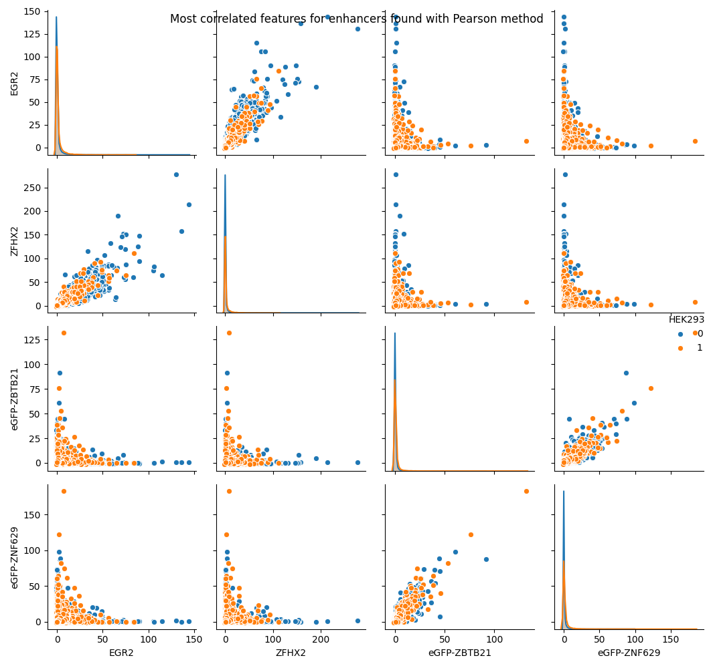
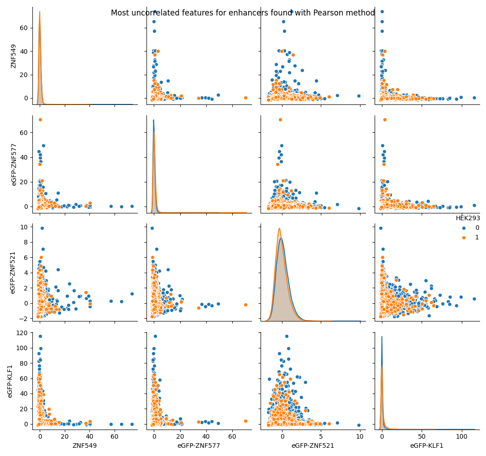

# Bioinformatics project

Analyze the active regulatory region of DNA using FFNN and CNN.

           

## Test coverage

Since some software handling coverages sometimes get slightly different results, here's three of them:

      

# Report

## Introduction

The phenotype is a term used in genetics to define the set of observable traits in an organism. It can be seen as the result of three factors: the expression of the genetic code of an organism, its interaction with the environment, and some casual events which can occur during its life. In particular, the main aspect is the gene expression, which is the process by which the information from a gene is used to synthesize all functional gene products, like RNA or proteins, essential for the life of all organisms and many viruses. The first step to define the gene expression is to study the DNA, which is the essential molecule that characterizes the organisms in general. It contains all the genetic instructions which regulate this process. Starting from its structure, the DNA is composed of two chains of nucleotides, combined together to compose a double helix. This molecule can be divided into subsequences of nucleotides and each of them has a specific task. These sequences can be grouped into two sets according to their main purpose: the coding and non-coding regions. The coding regions (the gene) contain the information to synthesize some gene products and the non-coding regions are responsible to help, regulate or modify the creation process of a specific gene product. The gene expression involves both these regions of the DNA and it is composed of two main processes: transcription and translation. Through the transcription process, a particular DNA coding region is copied inside the messenger RNA (mRNA) thanks to some proteins, the RNA polymerase and other transcription factors, specific for each gene product. In particular, RNA polymerase binds to a particular region of DNA, called the promoter, and activates the transcription process. The initial version of mRNA contains redundant information and it consists of alternating segments called exons (coding regions) and introns (redundant regions). The RNA splicing method is applied to remove the introns and to produce the final mRNA sequence. After that, the mRNA goes out from the cell nucleus, and then the translation process starts. The mRNA sequence is divided into small groups of 3 nucleotides. Each of these triplets, also known as codon, corresponds to a specific amino acid. The result sequence of amino acids forms the final gene product. It is important to specify that a single coding region can generate many different products and the non-coding region play a big role in gene expression. There are two main types of non-coding regions: trans-regulatory elements (TREs) and cis-regulatory elements (CREs). TREs are particular types of genes that may modify or regulate the expression of other genes, often encoding transcription factors. Other non-coding regions, the CREs, are close to the genes that they regulate by bindings to the transcription factor. In particular, enhancers and silencers interact with promoters, through RNA polymerase and other transcription factors, to influence or repress, respectively, the gene expression. There are hundreds of different cell types in an organism despite they share the same DNA. This means that the gene expression is different according to the cell line and the type of product to be synthesized. In particular, the DNA may be used by the cell in very different ways and its regions may be active or inactive, producing a different level of expression for each gene. Determine the activation of the regions is a very important task in biology, it can be useful to determine the phenotype expressed by an organism or to control the gene expression in a specific cell line or, again, to understand better the complex interaction between the DNA and the transcription factors. Besides, this technique can help during the diagnosis, to determine the current or future pathology or to find the best therapy according to the genetic characteristics of the patient. However, determine if a DNA region is active or not is very hard and expensive: the amount of data to collect is huge and its analysis is very complex. The new information technologies can help to simplify this task, supervised machine learning in particular. The idea is to train a learning machine using some examples, DNA regions labeled as active and inactive, so that it can predict the status of an unknown region considering only its specific features. In literature, a lot of methods are proposed. In [1] it is used a deep feedforward neural network to predict active enhancer, active promoter, active exon, inactive enhancer, inactive promoter, inactive exon, and uncharacterized regions. Another method, DeepEnhancer [2], uses CNN to find enhancers and specialize the learning process on the cell line using the transfer learning technique. Moreover, Basset [3] is an open-source system that applies CNN to learn simultaneously the relevant DNA sequence motifs and the regulatory logic to determine cell-specific DNA accessibility. Following work, Basenji [4], modify the previous system to identify promoters and the relative regulatory elements and synthesize their content to make more precise gene expression predictions. The aim of this project is to predict if regulatory elements, such as promoters and enhancers, are active or inactive using supervised deep learning methods. 

# Experimental setup

## Data retrieval

In this project, it is analyzed a specific cell line, HEK293, in order to predict the activation of promoters and enhancers. We consider a set of regions of the cell line genome, 200 nucleotides long. Each region corresponds to a CRE (promoter or enhancer), which may be active or not, and it is characterized by both sequence and epigenomic data. In detail, the sequence data is simply the nucleotide sequence and the epigenomic data refers to the level of interaction between proteins and genome. Starting from the epigenomic data, they come from the [ENCODE](https://www.encodeproject.org/) project and the data considered are obtained by the ChiP-sequencing technique. The labels of our data, that say if a region is active or inactive, are taken from FANTOM, which contains a wide collection of promoters and enhancers. The amount of data obtainable from ENCODE is extremely large and they must be queried with the FANTOM data to extract the interesting regions. Fortunately, this task has been already done and the epigenomic data of promoters and enhancers can be found in this [repository](https://github.com/LucaCappelletti94/epigenomic_dataset), which offers also a python package to automatically download and use these data in a program. The sequence data instead requires the genome sequence of the cell line, obtainable from [UCSC Genome Browser](https://genome.ucsc.edu/index.html) with this python [utility](https://github.com/LucaCappelletti94/ucsc_genomes_downloader), which can be filtering in order to obtain the nucleotide sequences of promoters and enhancers. Subsequently, the sequence data are one-not encoded to make easier the next tasks.

## Data checking

In an machine learning project, it is very important to check the data to find errors or inconsistencies which could degrade the performance of the learning models. 

### Sample features imbalance

This control aim to verify if the rate between samples and features is high or not. Having a low rate means that the sample are few respect to the features and the learning machine isn't able to generalize on the real data. Fortunately, this isn't the case of this dataset, in particular the rate between sample and features for promoters is 482 and 316 for enhancers.

### NaN values checking

In biology experiments, there are some practical cases where some data could be NaN. This situation, especially when the NaN values are many, is dangerous for the learning model. If it happens, there are a lot of different techniques to fix it. If there NaN values are concentrated in a single sample or in a single feature it is convenient to remove it. Otherwise, if the NaN values are scattered in all datasets, they could be replaced by empirical values, like the mean or the median. In the dataset of this project, there are only one NaN value (replaced with the mean) in the enhancers epigenomic data and no one for the promoters. 

### Class imbalance

In some real dataset, especially in biology, there could be a strong imbalance between classes. For example, if it is considered a rare disease, the positive samples are few than the negative one and the learning machine will tend to predict a wrong result, tending to the majority class. In these cases, it is necessary to adopt techniques to avoid this problem. The data considered in this project are imbalanced as shown by the figure.

### Constant feature

In some dataset could be features with the same value for each sample. This situation doesn't help the learning machine and the these features can be removed. This is not the case of the data used in this projet. every features has different values in at most one sample.

### Z-scoring

Z-scoring is a way to standardizing the data. The Z-score is the number of standard deviation by which the value of a raw score is closed to the population mean: it is positive if it is above the mean or it is negative otherwise. The Z-scoring is calculated by subtracting the average and dividing by the standard deviation and the new data are mean 0 and variance 1. This method has a problem related to the outliers and it has to be fixed by subtracting the median and dividing by the standard deviation between the interquartile range from 0.25 to 0.75.

## Data correlation with output

Another check which can be applied to the data is the correlation between features and output. If a feature isn't correlated with a specific output it is completely useless and it can be dropped. To do this, the Pearson and Spearman tests are applied, which measure the monotonic and linear correlations respectively. After that, the candidate non-correlated features are tested with the MIC (Maximal information coefficient) that tests the non-linear correlation between features and output. Only the features found with Pearson and Spearman methods are tested using MIC because it is computationally very complex. More in detail, the Pearson correlation method measures the linear correlation between the two datasets. In particular, the Pearson coefficient has a value between -1 and +1, where -1 is a total negative linear correlation, 0 implying no correlation, and +1 is a total positive linear correlation. Instead, the Spearman correlation coefficient doesn't require that the two datasets are normalized and it measures the monotonicity relationship between them. The Spearman coefficient varies between -1 and +1, like Pearson's. Now is the moment to apply the MIC procedures to the feature selected by Pearson and Spearman method in order to find non-linear correlations. It is important to specify that Pearson's, Spearman's and MIC's results are significant if they are is calculated over a large dataset, typically with 500 samples or more. At the end the features uncorrelated with output can be removed.

## Feature correlation

To make the data less heavy, it is possible to find and remove tightly correlated features. The correlation can be measured using the Pearson or MIC method. In this project, the Pearson method is used to save time (MIC is computationally complex). When two features appear correlated, the one with the lower entropy is removed. The entropy can be interpreted as the average level of information or uncertainty given by a variable. In this project, there aren't features extremely correlated but it is interesting to examine the most correlated and least correlated features, as shown in the images below. The first pair of images show the two most correlated features in promoters and enhancers respectively, while the last pair show the two most uncorrelated features in the same regions. The blue and orange colors refers to inactive and active region respectively.

## Data distribution

Visualizing the data distribution is helpful to better understand the dataset composition. Since the features are about 200 and it is difficult and useless to represent all distributions, there were selected and represented the 5 most different features between active and inactive regions, both for promoters and enhancers. The histograms below represent the Euclidean distance between the feature values, which are filtered before 0.05 and after 0.95 percentile to reduce the impact of the outliers. In particular, the blue and orange colors refers to inactive and active region respectively. The first image shows the feature distributions of promoters and the second one shows the enhancers features distributions.

Another interesting point of view is given by the visualization of the differences between the distributions of the pairs of features. As done in the previous method, only the 5 most different pairs of features are considered and the considered values are between 0.05 and 0.95. This time the colors represent the two features and not the regions activation. 

# Bibliography 

[1] Yifeng Li, Wenqiang Shi, and Wyeth W. Wasserman. "Genome-wide prediction of cis-regulatory regions using supervised deep learning methods"

[2] Xu Min et al. "Predicting enhancers with deep convolutional neural networks"

[3] Kelley DR, Snoek J, Rinn JL. 2016. Basset: learning the regulatory code of the accessible genome with deep convolutional neural networks.

[4] David R. Kelley, Yakir A. Reshef,2 Maxwell Bileschi, David Belanger, Cory Y. McLean, and Jasper Snoek. "Sequential regulatory activity prediction across chromosomes with convolutional neural networks"

